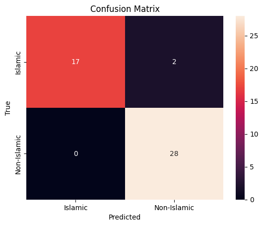

# 🕌 Islamic Text Classifier (AI/NLP Project)

This project uses machine learning to classify whether a given piece of text is **Islamic** (faith-based) or **Non-Islamic** (general/worldly content). It's the first step in a broader roadmap to build a responsible, explainable **Muslim scholar chatbot** — grounded in verified Islamic knowledge and ethical AI principles.

But the most interesting part for this classification is, how it perform in the grey area. There are many miracles and science based statements in Quran that are stated 1400 years ago. So I put some of those discovery in Islamic where it states in Quran it was stated. And I also put those exact same discoveries without mentioning any Quranic reference. And It still surprisingly did well. But of course there are always rooms to make it better, especially if the dataset is way bigger than this.

## 📌 Project Overview

- **Goal**: Train a text classification model to distinguish Islamic content from non-Islamic content.
- **Approach**: TF-IDF vectorization + Naive Bayes classifier.
- **Dataset**: 231 short texts (121 Islamic, 110 Non-Islamic).
- **Result**: Achieved **96% accuracy** on a diverse validation set.

Here is the confusion matrix showing the model's performance:



| Label         | Precision | Recall | F1-Score | Support  |
|---------------|-----------|--------|----------|----------|
| Islamic       | 1.00      | 0.89   | 0.94     | 19       |
| Non-Islamic   | 0.93      | 1.00   | 0.97     | 28       |

This notebook serves as a foundation for more advanced NLP projects like semantic search, intent classification, and faith-safe chatbots.

---

## ▶️ Run on Google Colab

Step 1: <a href="https://colab.research.google.com/drive/1WSTnYBDUIw2wnAmedWeBwngHRGOz337z?usp=sharing"></a>  
Step 2: Upload islamic_text_data.csv inside the sample_data folder  
Step 3: Run all cells in the notebook  

📁 Project Structure

```bash
sample_data/
├── islamic_text_data.csv        # Input dataset
```

---

## 🧠 What I Learned

- How to process text data using TF-IDF
- How Naive Bayes works for real-world text classification
- Importance of recall in faith-based models (to avoid missing relevant Islamic content)
- How to analyze model performance using precision, recall, F1, and confusion matrix
- This project is like building the "eyes" of a future AI system — it learns to see and understand what kind of content it's dealing with before responding.

### 🔬 My AI Research Roadmap

This is the first step in building an explainable, ethical AI system for Islamic knowledge applications:

🔎 Project 2: Qur’an & Hadith semantic search (QA retrieval)  
[Project 2: Qur’an & Hadith semantic search (QA retrieval)](https://github.com/Akane-Asahi/Qur-an-Hadith-semantic-search-QA-retrieval-)  
[](https://github.com/Akane-Asahi/Qur-an-Hadith-semantic-search-QA-retrieval-)  
<a href="https://github.com/Akane-Asahi/Qur-an-Hadith-semantic-search-QA-retrieval-">
  
</a>  
🧠 Project 3: Islamic intent classifier (Dialogue Act Tagging)  
🧩 Project 4: Build a rule-based + ML-based chatbot engine  
🤖 Project 5: Fine-tune LLMs on faith-aligned data (e.g., FaithDial)  

## 🤝 Author & Motivation
Built by Telot as part of a personal and academic journey to explore the intersection of:

📜 Faith-based knowledge  
🧠 Responsible AI  
🧪 Research in NLP and conversational agents  

This project is my first practical step toward a Muslim scholar chatbot that is rooted in verified sources and ethical design.

## 📬 Contact

Want to collaborate, mentor, or discuss faith-aware AI?
📧 Reach out at: heytelot@gmail.com
🌐 LinkedIn: 
<a href="https://www.linkedin.com/in/mosfaiulalam/">
  
</a>

🪪 License
This project is open source under the MIT License.
